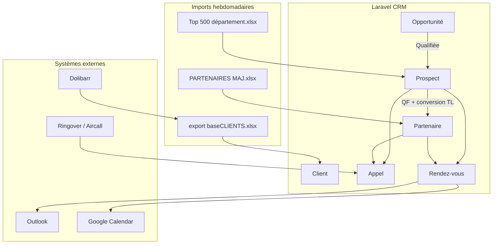
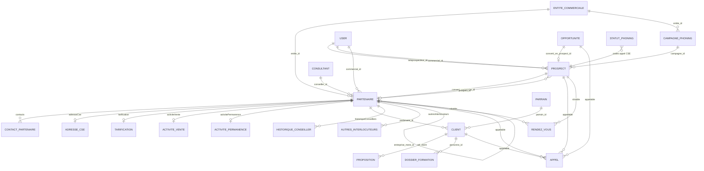
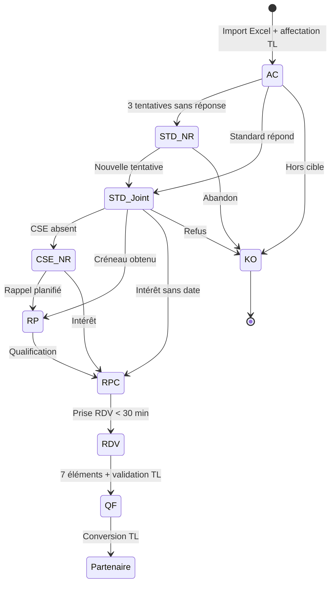

# Modèle de projet — CRM AOPIA / LIKE Formation (Laravel + Filament)

**Version** : 1.0 — Juin 2026  
**Sources** : CDC EspoCRM v1.0, workflows v2 (`directive/new directive aopiacrm/`), fichiers Excel réels, implémentation `crmfilament`

---

## 1. Contexte et périmètre

### 1.1 Objectif métier

Déployer un **CRM commercial unifié** pour AOPIA et LIKE Formation (NS Conseil), couvrant :

- Prospection CSE / syndicats / entreprises (phoning)
- Gestion des partenaires conventionnés
- Suivi des clients bénéficiaires (import Dolibarr)
- RDV commerciaux, reporting, base de connaissances

**Hors périmètre** (reste dans Dolibarr) : facturation, paiements, suivi pédagogique formateurs, devis.

### 1.2 Stack technique retenue

| CDC initial | Implémentation actuelle |
|---|---|
| EspoCRM (self-hosted) | **Laravel 11 + Filament 3** |
| Panel EspoCRM | Panel `ns-conseil` (`/ns-conseil`) |
| Ringover (téléphonie) | Intégration Aircall + tags statuts |
| Outlook / Google Calendar | `GoogleCalendarService`, `RendezVous` |

Le présent document **traduit le CDC EspoCRM** vers le modèle de données Laravel existant.

### 1.3 Arborescence fonctionnelle

```
CRM NS Conseil (Filament)
├── Pipeline
│   ├── Opportunités          → opportunites
│   ├── Prospects             → prospects (+ campagne_phonings)
│   └── Partenaires           → partenaires
├── Contacts
│   ├── Contacts partenaires  → contact_partenaires
│   └── Autres interlocuteurs → autres_interlocuteurs
├── Activités
│   ├── Appels                → appels (polymorphe)
│   ├── RDV                   → rendez_vous (polymorphe)
│   ├── Permanences           → activite_permanences
│   ├── Scripts d'appel       → scripts_appel
│   └── Workflow phoning      → PhoningWorkflow (page)
├── Clients & Formations
│   ├── Clients bénéficiaires → clients
│   ├── Propositions          → propositions
│   ├── Dossiers formation    → dossier_formations
│   └── Parrainage            → parrains
├── Administration
│   ├── Campagnes phoning     → campagne_phonings
│   ├── Statuts phoning       → statut_phonings (dictionnaire)
│   ├── Imports               → prospect_import_batches, partner_import_batches
│   └── Entités commerciales  → entite_commerciales (AOPIA / LIKE)
└── Outils transversaux
    ├── Documents             → documents (polymorphe)
    ├── Emails / Templates    → AopiaMailTemplateService
    ├── PDF récap             → PdfController + AopiaIcsService
    └── Reporting             → Widgets Filament + mails planifiés
```

---

## 2. Architecture des flux



| Flux | Source | Cible | Mode | Fréquence |
|---|---|---|---|---|
| Clients bénéficiaires | Dolibarr | `clients` | Import Excel | Chaque lundi |
| Prospects phoning | Fichier Top 500 | `prospects` | Import Excel | Par campagne |
| Partenaires | Feuille MAJ | `partenaires` | Import Excel | Hebdomadaire |
| RDV commerciaux | CRM | Outlook / Google | Sync bidirectionnelle | Temps réel |
| Historique phoning | CRM uniquement | — | Pas de remontée | — |
| Mail hebdo | CRM | Commerciaux / TL | Tâche planifiée | Lundi 08h00 |

---

## 3. Modèle de données — diagramme entité-relation



---

## 4. Entités principales

### 4.1 Partenaire (`partenaires`)

**Rôle CDC** : compte partenaire signé (CSE, syndicat, entreprise, association).

| Champ CDC | Colonne Laravel | Type | Obligatoire |
|---|---|---|---|
| Nom du partenaire | `nom` + `nom_retenu` | string | Oui |
| Type | `type` → `OrganizationType` | enum | Oui |
| État / Statut | `statut` → `OrganizationStatus` | enum | Oui |
| Entreprise mère | `entreprise_mere_id` | FK partenaires | Non |
| SIRET | `siret` | string | Non |
| Adresse | `adresse`, `code_postal`, `ville` | string | Oui |
| Département | `departement` | string | Oui |
| Commercial / Mandataire | `commercial_id` | FK users | Oui |
| Conseiller | `conseiller_id` | FK consultants | Non |
| Entité (AOPIA/LIKE) | `entite_id` | FK entite_commerciales | Oui |
| Date convention | `date_convention` | date | Non |
| Origine contact | `origine_contact` | string | Non |
| Nb salariés | `nb_salaries` | int | Non |
| Parrain / Marraine | `parrain_marraine_texte` | text | Non |
| Bloc CSE | `cse_*` (12 champs) | divers | Non |
| Bloc Syndicat | `syndicat_*` (10 champs) | divers | Non |
| Bloc Dirigeant | `dirigeant_*` (5 champs) | divers | Non |

**Statuts partenaire** (`OrganizationStatus`) :

| Code | Label CDC | Transition typique |
|---|---|---|
| `a_prospecter` | À prospecter | → en_cours_prospection |
| `en_cours_prospection` | En cours de prospection | → signe_accord_cadre / refus |
| `rdv_en_cours` | RDV en cours | → signe_accord_cadre |
| `signe_accord_cadre` | Signé accord cadre | → convention_engagement |
| `convention_engagement` | Convention d'engagement | Partenaire actif |
| `refus` | Refus | → a_prospecter (reprise) |

**Tables satellites** (découpage type `AccountDetails` EspoCRM) :

- `adresse_cses` — adresse postale CSE distincte
- `tarifications` — grilles tarifaires
- `activite_ventes` — ventes 2025/2026, dernière vente
- `activite_permanences` — permanences planifiées/réalisées
- `remboursements_employeur` — remboursements
- `historique_conseillers` — changements de conseiller
- `autres_interlocuteurs` — contacts libres illimités

---

### 4.2 Prospect (`prospects`)

**Rôle CDC** : pipeline de prospection phoning avant signature partenaire.

#### Double couche de statuts

Le projet distingue **deux niveaux** de qualification :

| Couche | Table / Enum | Usage |
|---|---|---|
| **Statut fiche** | `ProspectStatut` (enum) | Pipeline CRM : AC → STD-NR → … → QF |
| **Statut appel** | `statut_phonings` + `appels.phoning_result` | Tags Ringover CSE v2 (14 codes) |

#### Statuts fiche (`ProspectStatut`)

| Code | Label | Visible par |
|---|---|---|
| `AC` | À contacter | Téléprospecteur |
| `STD_NR` | Standard non répondu | Téléprospecteur |
| `STD_Joint` | Standard joint | Téléprospecteur |
| `CSE_NR` | CSE non joint | Téléprospecteur |
| `RP` | Rappel planifié | Téléprospecteur + Commercial |
| `RPC` | RDV à planifier | Téléprospecteur + Commercial |
| `KO` | Hors cible / Refus | Team Leader |
| `QF` | RDV qualifié | Commercial (après validation TL) |

**Service de workflow** : `AopiaProspectWorkflowService` — matrice de transitions + validation QF (7 conditions).

#### Statuts appel Ringover v2 (`statut_phonings`, model_type = `prospect`)

| Code | Signification | Action |
|---|---|---|
| `NRP` | Ne répond pas | Vérif. numéro Nirina |
| `FAX` | Fax / numéro incorrect | Vérif. numéro |
| `SUPP` | À supprimer | Sortie fichier |
| `MAJ` | Numéro mis à jour | Recomposer |
| `RDV` | RDV confirmé élu | Dossier → commercial |
| `CSE-NI` | Élu non intéressé | Fiche jaune J+7 |
| `RAPL-ELU` | Rappel demandé par l'élu | Tâche prioritaire |
| `RAPL-STD` | Rappel suggéré standard | Tâche normale |
| `BLOC` | Bloqué au standard | Rappel J+2 |
| `BLOC2` | Toujours bloqué | Fiche verte commercial |
| `NCSE-50` | Pas de CSE < 50 sal. | Mail + fiche verte |
| `NCSE+50` | Pas de CSE ≥ 50 sal. | Insister |
| `CSE-ZONE` | CSE centralisé en zone | Planifier appel |
| `CSE-HZ` | CSE centralisé hors zone | → Bruno |

**Règle d'or Ringover** : chaque appel = tag `DEP_XX` + tag statut.

#### Champs clés

| Champ CDC | Colonne Laravel |
|---|---|
| Raison sociale | `nom` / `raison_sociale` |
| Type pressenti | `type_pressenti` |
| Département | `departement` |
| Téléphone 1 / 2 | `telephone` / `telephone_alt` |
| Téléprospecteur | `teleprospecteur_id` |
| Commercial | `commercial_id` |
| Campagne | `campagne_id` |
| Interlocuteur standard | `nom_interlocuteur_standard` |
| Validation QF | `qf_valide`, `valide_par`, `qf_valide_at` |
| Motif KO | `motif_ko` |
| Rappel planifié | `rappel_planifie_at` |

---

### 4.3 Opportunité (`opportunites`)

**Rôle CDC** : sas d'entrée avant prospection active (détection → qualification → conversion).

| Statut CDC | Statut Laravel actuel | Écart |
|---|---|---|
| Nouveau | `nouveau` | ✅ |
| En cours d'évaluation | `en_qualification` | ⚠️ libellé différent |
| Qualifiée | — | ❌ manquant |
| Converti | `converti` | ✅ |
| Perdue | `perdu` | ✅ |

**Sources CDC** : réseau commercial, client existant, parrainage, phoning entrant, salon, LinkedIn, fichier externe, autre.

> **Backlog** : aligner `Opportunite::STATUTS` et `SOURCES` sur le CDC §4.3.

---

### 4.4 Client bénéficiaire (`clients`)

**Rôle CDC** : bénéficiaire importé depuis Dolibarr (pas de données financières sensibles).

| Champ Dolibarr (Excel réel) | Colonne Laravel | Importé |
|---|---|:---:|
| Civilité | `civilite` | ✅ |
| Réf. client | `ref_client` | ✅ (clé dédup.) |
| Tiers | `nom_tiers` (+ split prénom/nom) | ✅ |
| Téléphone | `telephone` | ✅ |
| Email | `email` | ✅ |
| Adresse / CP / Ville | `adresse`, `code_postal`, `ville` | ✅ |
| Date de naissance | `date_naissance` | ✅ |
| Entreprise | `entreprise` | ✅ |
| Partenaire | `partenaire_id` (matching nomenclature) | ✅ |
| Ne plus contacter | `ne_plus_contacter` | ✅ |
| Statut formation | `etat` + `propositions.statut_formation` | ✅ |
| Heures formation | `propositions.nb_heures_*` | ✅ |
| Montant CPF | `montant_cpf` | ⚠️ stocké mais CDC = exclu |
| Consultant formateur | `extra_data` | ⚠️ non affiché CRM |

**Feuilles Excel Dolibarr** (fichier `export (6)-baseCLIENTS_13052026.xlsx`) :

- `CRM LIKE` — 7719 lignes
- `CRM AOPIA-ABO` — 4315 lignes
- `CRM 01FC` — 3840 lignes

**Règle déduplication** : `ref_client` → fallback `nom + prénom + date_naissance`.

---

### 4.5 Appel (`appels`) — polymorphe

```
appelable_type / appelable_id → Prospect | Partenaire | Opportunite | Client
```

| Champ | Colonne | Usage |
|---|---|---|
| Type | `type` → `EventType` | Appel / Permanence / Présentation |
| Résultat | `resultat` → `EventResult` | Résultat générique |
| Statut phoning | `phoning_result` | Code Ringover (lien `statut_phonings`) |
| Date/heure | `date_heure` | Obligatoire |
| Durée | `duree_secondes` | CTI Aircall |
| Audio | `enregistrement_audio` | Obligatoire pour QF |
| Fiche récap | `fiche_type`, `fiche_data` | PDF généré |
| Campagne | `campagne_id` | Lien campagne phoning |
| Agent | `user_id` / `phoning_agent_id` | Téléprospecteur |

---

### 4.6 Rendez-vous (`rendez_vous`) — polymorphe

| Champ CDC | Colonne Laravel |
|---|---|
| Date et heure | `date_heure` |
| Lieu sur site | `lieu`, `adresse`, `code_postal`, `ville` |
| Interlocuteur | `interlocuteur_nom` |
| Commercial assigné | `commercial_id` |
| Type RDV | `type` (Appel / Permanence / Présentation) |
| Résultat | `resultat` (Réalisé / Annulé / Décalé) |
| Sync calendrier | via `RendezVousObserver` + Google |

---

### 4.7 Campagne phoning (`campagne_phonings`)

| Champ | Description |
|---|---|
| `nom` | Ex. « Opération phoning 44 BIRE 2026 » |
| `type_entite` | prospects / partenaires / clients |
| `criteres` | JSON : département, statuts, nb_salaries_min/max |
| `entite_id` | AOPIA ou LIKE Formation |
| `statut` | brouillon / active / terminee |

---

### 4.8 Dictionnaire statuts (`statut_phonings`)

Table paramétrable (seed : `database/seeders/data/statuts_phoning_prospect.php`) remplaçant les listes fixes EspoCRM.

```
UNIQUE (model_type, code)
model_type ∈ {prospect, partenaire, opportunite, client}
```

Champs workflow CSE (éditables Ns Conseil > Statuts Phoning) :

| Champ | Rôle |
|---|---|
| `groupe` | Cas workflow (lien `workflow_groupes.code`) |
| `pipeline_statut` | Statut prospect appliqué après l'appel |
| `action_immediate` | Consigne affichée à l'agent |
| `delai_rappel_jours` | Relance automatique (BLOC J+2, CSE-NI J+7…) |
| `fiche_type` | bleue / jaune / verte |
| `note_obligatoire` | Validation commentaire |
| `compte_comme_tentative` | Incrémente compteur NRP/FAX |
| `prioritaire` | Passe en tête de file |
| `retire_de_file` | Exclut du phoning (SUPP, CSE-HZ) |

---

### 4.9 Paramétrage CRM (Super Admin)

Architecture **double couche** : statuts d'appel Ringover ≠ statuts pipeline fiche.

| Table | Seed | Back-office | Consommateurs |
|---|---|---|---|
| `crm_profiles` | `data/crm_profiles.php` | Super Admin > Profils CRM | `CrmProfileService`, `User::canAccessPanel()` |
| `crm_settings` | `data/crm_settings.php` | Super Admin > Paramètres CRM | `CrmSettingsService` (cache 5 min) |
| `pipeline_statuts` | `data/pipeline_statuts.php` | Super Admin > Statuts pipeline | Transitions prospect/partenaire/opportunité |
| `workflow_groupes` | `data/workflow_groupes.php` | Super Admin > Groupes workflow | UI workflow CSE, `CsePhoningWorkflow` |
| `statut_phonings` | `data/statuts_phoning_*.php` | Ns Conseil > Statuts Phoning | `PhoningWorkflow`, mapping `pipeline_statut` |

`config/aopia.php` reste un **repli** si la BDD n'est pas seedée.

Services :

- `app/Services/Crm/CrmSettingsService.php` — clés pointées (`prospection.max_standard_attempts`, `roles.teleprospecteur_roles`, `qf.minimum_employee_count`…)
- `app/Services/Crm/CrmProfileService.php` — panels, landing, capacités (`validate_qf`, `is_supervisor`, `can_import`)
- `app/Services/Crm/PipelineStatutService.php` — labels et transitions autorisées

Ordre de seed (`DatabaseSeeder`) : Rôles/Profils → Users → Settings → Groupes → Pipeline → Statuts phoning.

---

## 5. Workflows métier

### 5.1 Workflow prospection CSE (CDC + v2 HTML)



### 5.2 Les 7 éléments bloquants QF

Contrôlés par `AopiaProspectWorkflowService::champsManquantsPourQf()` :

1. RDV créé (date, heure, lieu sur site)
2. Email confirmation CSE (Template 1)
3. Champs obligatoires fiche renseignés
4. PDF récap généré
5. Enregistrement audio
6. Email invitation commercial (Template 2)
7. Validation Team Leader

### 5.3 Cycle de vie partenaire

```
Import MAJ → À prospecter → En cours → Signé accord cadre → Convention engagement
                                    ↘ Refus → (reprise) À prospecter
```

### 5.4 Conversion des entités

| Conversion | Acteur | Condition |
|---|---|---|
| Opportunité → Prospect | Commercial / TL | Statut = Qualifiée |
| Prospect → Partenaire | Team Leader uniquement | Statut = QF validé |
| Top 500 → Prospect | Team Leader | Import campagne |

---

## 6. Mapping imports Excel (fichiers réels)

### 6.1 Prospects — Top 500 département

**Fichiers** :
- `Fichier top 500 departement 45_TEST.xlsx` (feuilles `Feuille 1`, `> 20`)
- `LIKEFORMATION_Fichier top 500 du département - 44_BIRE_Opération phoning 2026 - Copie.xlsx` (feuille `Dpt 44_BIRE`)

**Classe** : `ProspectImporter`

| Colonne Excel | Champ `prospects` |
|---|---|
| N° / N° | `numero_ordre` |
| Raison sociale | `nom` |
| Adresse | `adresse` |
| CP | `code_postal` |
| Ville | `ville` |
| nbr salariés / Nbrs de salariés | `nb_salaries` |
| telephone 1 / Téléphone 1 | `telephone` |
| telephone 2 / Téléphone 2 | `telephone_alt` |
| Siret / Siret | `siret` |
| Chiffred'affaires / CA | `chiffre_affaires` |
| Secteur d'activités | `secteur_activite` |
| Conseiller | `teleprospecteur_id` (résolution User) |
| Dpt | `departement` |
| Etat | `statut` (mapping ProspectStatut) |
| Date de 1er contact | `date_premier_contact` |
| Commentaires | `description` |

**Déduplication** : `telephone` prioritaire, sinon `nom + departement`.

---

### 6.2 Partenaires — fichier PARTENAIRES

**Fichier** : `PARTENAIRES_LF_AOPIA_CONTACTYS_LFS (15).xlsx`  
**Feuille cible** : `MAJ` uniquement (`PartenaireImportResolver::TARGET_SHEET`)

| Colonne Excel | Champ `partenaires` |
|---|---|
| Entité | `entite_id` (AOPIA / LIKEFORMATION) |
| ENTREPRISE | `entreprise` |
| NOM RETENU | `nom_retenu` / `nom` |
| Nb salariés | `nb_salaries` |
| Statut | `statut` (mapping OrganizationStatus) |
| Année | `annee_signature` |
| Date de signature | `date_signature` |
| TYPE | `type` (OrganizationType) |
| Origine du partenariats | `origine_contact` |
| PARRAIN/MARRAINE | `parrain_marraine_texte` |
| Conseiller | `conseiller_id` |
| Ancien conseiller | → `historique_conseillers` |
| Mandataire/VDI | `commercial_id` |
| Département conseiller | `departement` |
| Adresse CSE / CP / Commune | → `adresse_cses` |
| Nom du contact | → `contact_partenaires` |
| Nombre de ventes / Ventes 2025/2026 | → `activite_ventes` |
| Permanences | → `activite_permanences` |

---

### 6.3 Clients — export Dolibarr

**Fichier** : `export (6)-baseCLIENTS_13052026.xlsx`

| Feuille | Lignes approx. | `source_sheet` |
|---|---|---|
| CRM LIKE | ~7719 | `CRM LIKE` |
| CRM AOPIA-ABO | ~4315 | `CRM AOPIA-ABO` |
| CRM 01FC | ~3840 | `CRM 01FC` |

**Clé** : `ref_client` (colonne « Réf. client » ou « Tiers » selon feuille).

---

## 7. Rôles et permissions

| Fonctionnalité | Téléprospecteur | Team Leader | Commercial | Admin |
|---|:---:|:---:|:---:|:---:|
| Prospects AC / En cours (sa liste) | ✅ | ✅ Tous | ✅ Secteur | ✅ |
| Saisie résultat appel | ✅ | ✅ | ❌ | ✅ |
| Validation QF | ❌ | ✅ | ❌ | ✅ |
| Conversion Prospect → Partenaire | ❌ | ✅ | ❌ | ✅ |
| Import bases | ❌ | ✅ | ❌ | ✅ |
| Fiche partenaire (édition) | Lecture | ✅ | Si affecté | ✅ |
| Clients bénéficiaires | ❌ | Lecture | Si secteur | ✅ |
| Base de connaissances | Lecture | Édition | ❌ | ✅ |
| Paramétrage CRM | ❌ | ❌ | ❌ | ✅ |

**Rôles Laravel** (Spatie) : synchronisés via `CrmProfileSeeder` depuis `database/seeders/data/crm_profiles.php`. Les capacités fines (QF, import, superviseur phoning) sont lues depuis `crm_profiles`, pas codées en dur dans les pages Filament.

---

## 8. Automatisations (workflows CDC)

| ID | Déclencheur | Action | Service Laravel |
|---|---|---|---|
| WF1 | RDV créé | Email confirmation CSE | `AopiaMailTemplateService` |
| WF2 | Fiche complète | Génération PDF récap | `PdfController` |
| WF3 | PDF + audio OK | Email invitation commercial | `AopiaMailTemplateService` + `AopiaIcsService` |
| WF4 | Passage QF | Blocage si manquants | `AopiaProspectWorkflowService` |
| WF5 | Lundi 07h30 | Mail récap télépros | Job à créer |
| WF6 | Lundi 08h00 | Mail récap commerciaux | Job à créer |
| WF7 | Statut RP | Tâche rappel | `rappel_planifie_at` + notification |

---

## 9. Panels Filament

| Panel | Path | Périmètre |
|---|---|---|
| `ns-conseil` | `/ns-conseil` | **CRM AOPIA / LIKE** (ce document) |
| `allopro` | `/allopro` | Centre de contact artisans (AlloPro 24/24) |
| `admin` | `/admin` | Administration générale |
| `super-admin` | `/super-admin` | Gestion BDD, users, rôles |

---

## 10. Écarts CDC ↔ implémentation (backlog priorisé)

### P0 — Alignement métier critique

| Écart | Fichier concerné | Action |
|---|---|---|
| Statuts Opportunité non conformes CDC | `Opportunite.php` | Ajouter `qualifiee`, aligner sources |
| Conversion Prospect requiert QF mais CDC dit « Convention signée » | `Prospect.php` | Clarifier règle avec métier |
| Mail hebdo non planifié | — | Créer `SendWeeklyReportJob` |
| Import clients multi-feuilles | — | Finaliser `ClientImporter` |

### P1 — Enrichissement

| Écart | Action |
|---|---|
| Statuts Ringover v2 mappés vers pipeline via `statut_phonings.pipeline_statut` | ✅ Fait — transitions enum restent à brancher sur formulaires Prospect |
| Outlook sync absente | Connecteur Microsoft Graph |
| Base de connaissances | Module `Document` avec arborescence CDC |
| Reporting dashboards TL | Widgets consolidés |

### P2 — Conformité nomenclature

| Écart | Action |
|---|---|
| Types partenaire CDC : « Partenariat annulé » | Ajouter à `OrganizationType` |
| Nomenclature `[Type] [Entreprise] [Ville]` | Validator à la création partenaire |

---

## 11. Fichiers de référence

| Document | Chemin |
|---|---|
| CDC complet | `directive/specs/CDC_CRM_EspoCRM_AOPIA (2).md` |
| Champs requis | `directive/specs/Champs_Requis_Par_Entite.md` |
| Workflow prospection v2 | `directive/new directive aopiacrm/Workflow_prospection_CSE_v2.html` |
| Statuts appels v2 | `directive/new directive aopiacrm/Statuts_appels_CSE_v2.html` |
| Excel clients Dolibarr | `directive/archive/export (6)-baseCLIENTS_13052026.xlsx` |
| Excel Top 500 (45) | `directive/archive/Fichier top 500 departement 45_TEST.xlsx` |
| Excel Top 500 (44 BIRE) | `directive/archive/LIKEFORMATION_Fichier top 500...xlsx` |
| Excel partenaires MAJ | `directive/archive/PARTENAIRES_LF_AOPIA_CONTACTYS_LFS (15).xlsx` |
| Workflow service | `app/Services/Aopia/AopiaProspectWorkflowService.php` |
| Seed statuts | `database/seeders/data/statuts_phoning_prospect.php` |
| Paramètres CRM | `database/seeders/data/crm_settings.php` |
| Profils CRM | `database/seeders/data/crm_profiles.php` |
| Settings service | `app/Services/Crm/CrmSettingsService.php` |

---

*Document généré depuis l'analyse croisée CDC + fichiers Excel réels + codebase Laravel — Juin 2026*
